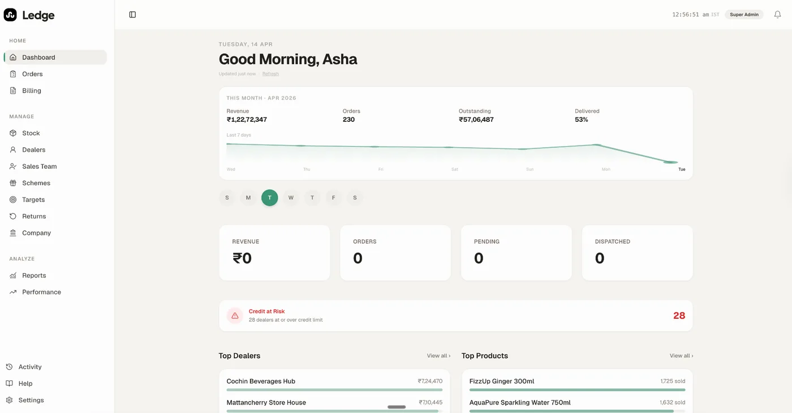
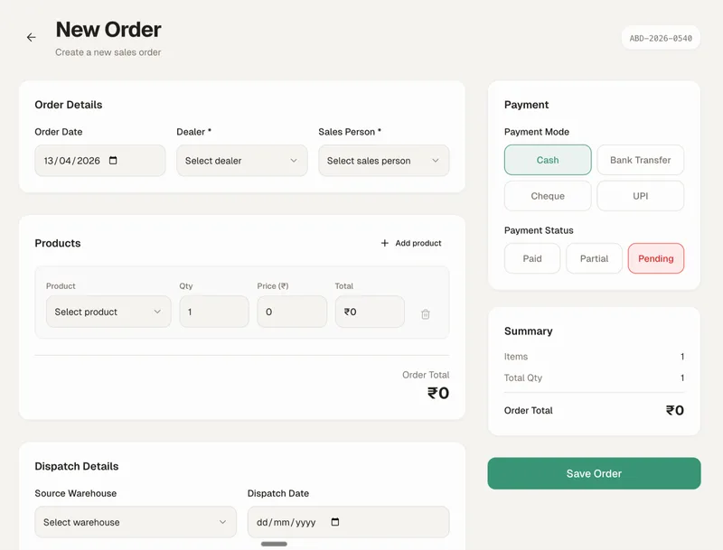
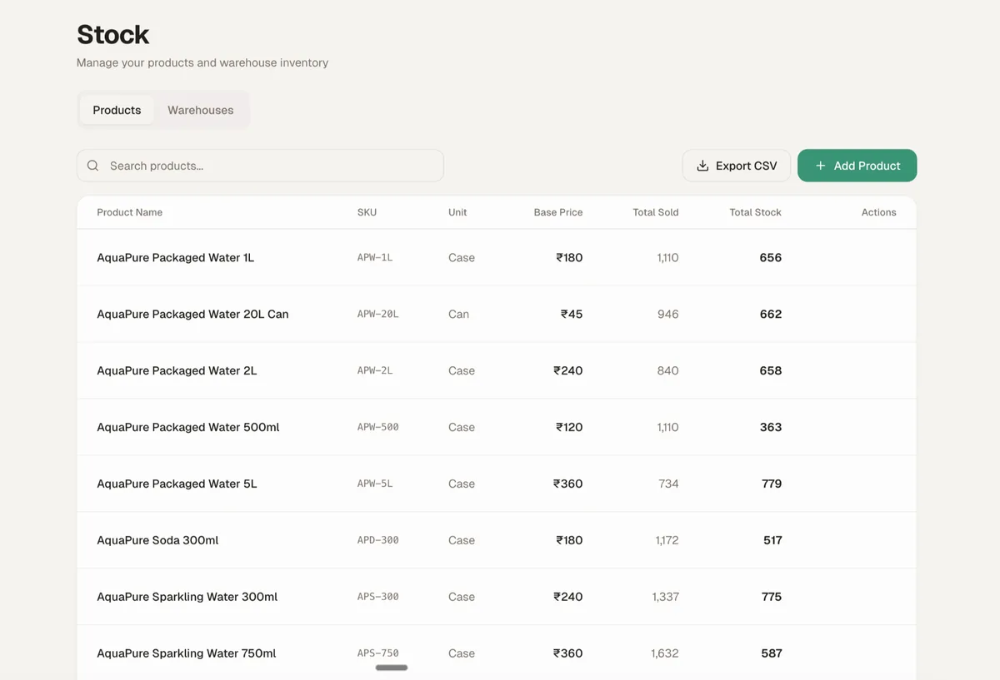
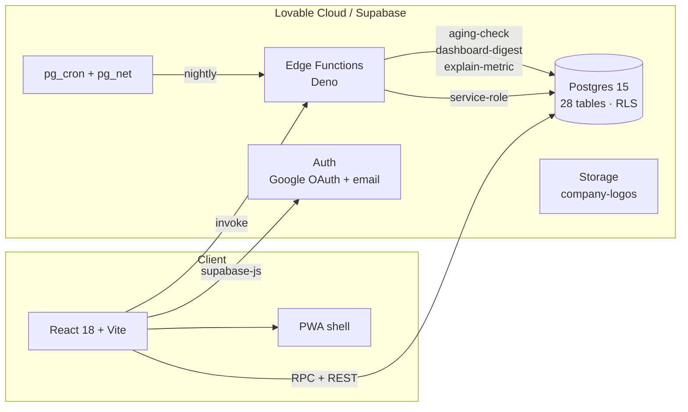

<p align="center">
  
</p>

<h1 align="center">Ledge</h1>

<p align="center">
  <strong>The mobile-first order-to-cash platform for Indian FMCG distribution.</strong><br/>
  Orders, dispatch, stock, billing, schemes, claims — one app, built for the field.
</p>

<p align="center">
  <a href="https://www.getledge.in"></a>
  
  
  
  
  
  
</p>

<p align="center">
  <a href="https://www.getledge.in"><b>Live site →</b></a>
  &nbsp;·&nbsp;
  <a href="https://ledge-fmcg.lovable.app"><b>Try the app →</b></a>
  &nbsp;·&nbsp;
  <a href="app/README.md"><b>Setup guide →</b></a>
  &nbsp;·&nbsp;
  <a href="#-quick-start-60-seconds"><b>60-second install →</b></a>
</p>

<br/>

<p align="center">
  
  
  
</p>

---

## What is Ledge?

Ledge is a multi-tenant SaaS that runs the **daily operating loop** of an Indian FMCG distributor — taking orders in the market, dispatching from the godown, collecting cash, settling schemes, and filing claims with the principal company. It replaces the patchwork of WhatsApp, Excel, paper challans, and Tally that most distributors run on today.

**Built for:**
- FMCG distributors and super-stockists in India (₹2 Cr – ₹500 Cr/yr turnover)
- Sales reps in the field who need to book orders on their phone
- Accountants who need clean invoices, aging reports, and claim files
- Owners who want a real-time view of the business from anywhere

---

## Features

| Orders | Dealers | Stock | Money |
|---|---|---|---|
| Multi-line orders | Profiles + GST/PAN | Multi-godown | Invoices |
| Schemes auto-applied | Credit limits | Auto-deduct on dispatch | Payments + aging |
| Dispatch + vehicle tracking | Outstanding aging | Threshold alerts | Schemes + claims |
| Returns + reversals | Sales-rep mapping | Stock value reports | TDS, GST-ready |

<details>
<summary><b>Full feature list</b></summary>

- **Order to dispatch** — quote, approve, dispatch, deliver, return; every transition timestamped
- **Schemes engine** — qty-based, value-based, free-goods, percentage; auto-applied at order entry
- **Stock auto-deduction** — `dispatch_order_atomic` RPC, idempotent + reversible
- **Multi-warehouse** — per-godown stock, transfers, threshold-based reorder alerts
- **Dealer 360** — orders, outstanding, aging buckets, credit utilisation, sales-rep
- **Sales-team management** — beat plans, target vs achievement, leaderboard
- **Notifications** — bell-icon centre + 60+ day aging triggers
- **Billing** — invoice numbering, payment modes, partial payments, TDS
- **Claims** — principal-company claim files with auto-aggregation
- **Reports** — dealer, product, payment, dispatch, sales-team, stock value
- **RBAC** — super_admin, sales_manager, sales_rep, accountant, viewer + per-capability overrides
- **Multi-tenancy** — isolated workspaces by `company_id`, RLS on every table
- **PWA** — installable on Android, works on flaky 2G/3G

</details>

---

## Architecture



---

## Tech stack

| Layer | Tech | Why |
|---|---|---|
| UI | React 18 · Vite 5 · Tailwind 3 · shadcn/ui | Fast iteration, design-token discipline |
| Type system | TypeScript 5 | Catches schema drift early |
| State | React Context + domain hooks | One source of truth (`DataContext`) |
| Backend | Supabase (Postgres 15 + Auth + Storage + Edge Functions + pg_cron) | One platform, RLS-first |
| AI | Lovable AI Gateway (Gemini 2.5) | No per-key infra; native cost controls |
| Tests | Vitest + Playwright | Unit + e2e in one toolchain |
| Hosting | Lovable / Render / Vercel | Recipient's choice |

---

## Quick start (60 seconds)

```bash
git clone git@github.com:<your-org>/ledge.git
cd ledge

nvm use                              # Node 22
bun install                          # or `npm install`

cp .env.setup.example .env.setup
$EDITOR .env.setup                   # paste Supabase project ref + tokens

./scripts/setup.sh --with-schema-restore
```

That single script links your Supabase project, applies all migrations, seeds storage buckets, writes the Vault `cron_secret`, deploys every edge function, generates your `.env`, and runs a build smoke test — idempotently. Re-runs are safe.

Then:

```bash
bun run dev          # http://localhost:8080
```

Full walkthrough lives in **[`app/README.md`](app/README.md)**.

---

## Documentation

| Doc | What's inside |
|---|---|
| **[`app/README.md`](app/README.md)** | 11-section deployment guide — Supabase, OAuth, hosting, domain, day-2 ops |
| **[`HANDOVER.md`](HANDOVER.md)** | First-time recipient checklist (8 steps) |
| **[`scripts/setup.sh`](scripts/setup.sh)** | One-shot installer with flag reference |
| **[`supabase/seed/README.md`](supabase/seed/README.md)** | How to regenerate `schema.sql` + storage seeds |
| **[`SECURITY.md`](SECURITY.md)** | Responsible-disclosure policy |
| **[`CONTRIBUTING.md`](CONTRIBUTING.md)** | PR conventions, commit style, branch model |

---

## Project status

- **Version** — `1.0.0` (production)
- **Tenants live** — multi-tenant from day one
- **Backend** — fully on Supabase, every table guarded by RLS, multi-region ready
- **PWA** — installable; offline mode currently paused (kill-switch shipped)

See [`.lovable/plan.md`](.lovable/plan.md) for the active roadmap.

---

## License

**Proprietary — All rights reserved.** See [`LICENSE`](LICENSE).

This software is delivered under a private transfer agreement. It is not open source.
Unauthorised copying, distribution, modification, or sublicensing is prohibited.

---

<p align="center">
  <sub>Designed and built in India · © 2026 Ledge</sub>
</p>
